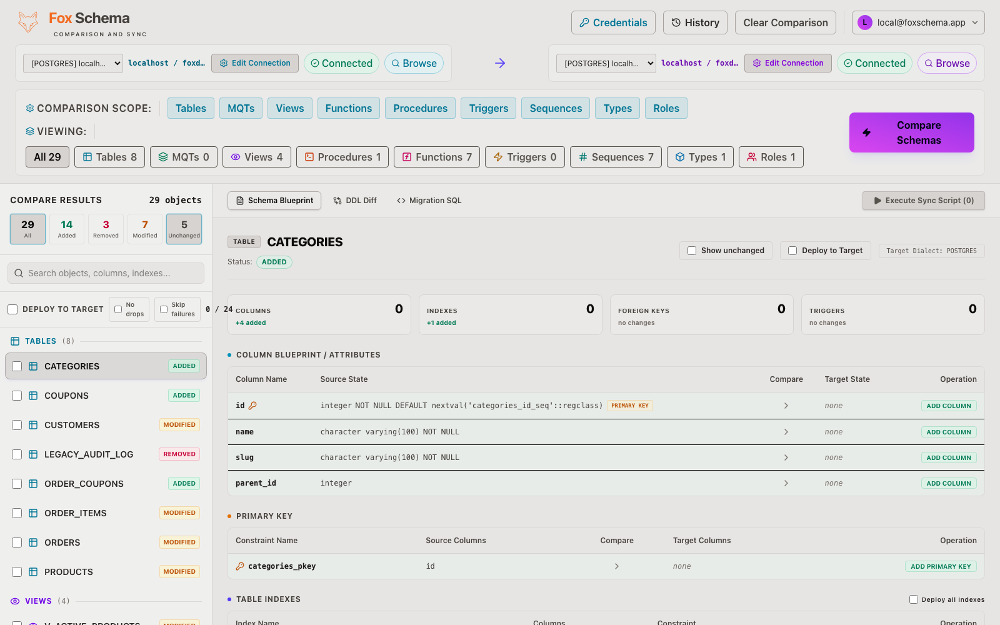

<div align="center">

# Fox Schema

**Compare two database schemas, see exactly what differs, and generate the migration SQL to make them match — across 10 SQL dialects.**

Runs as a self-hostable **web app**, a cross-platform **desktop app**, and a **terminal CLI**.

[foxschema.com](https://foxschema.com) · [Quick start](#quick-start) · [User guide](docs/USER_GUIDE.md) · [Deploy](docs/DEPLOYMENT.md) · [Contributing](CONTRIBUTING.md) · [Architecture](docs/ARCHITECTURE.md)

</div>

> [!WARNING]
> ## Desktop Application Status
>
> FoxSchema desktop builds for **macOS** and **Windows 11** are currently **unsigned** because I do not yet have a code-signing certificate.
>
> As a result:
>
> - **macOS** may display *"FoxSchema.app is damaged"* or *"Apple cannot verify this app"*.
> - **Windows 11** may display a **Microsoft Defender SmartScreen** warning.
>
> These warnings are expected for unsigned applications and **do not indicate malware**.
>
> If you prefer to avoid these security prompts, you can:
>
> - Clone the repository
> - Build FoxSchema from source
> - Run it directly from your local build
>
> ```bash
> git clone https://github.com/tedious-code/foxschema.git
> cd foxschema
> # Follow the build instructions below
> ```
>
## macOS Gatekeeper

FoxSchema is currently distributed **without an Apple Developer code-signing certificate**. Because of this, macOS Gatekeeper may prevent the application from opening.

If you downloaded the release from the official GitHub repository, you can bypass Gatekeeper:

### Option 1 (Recommended)

1. Open **System Settings → Privacy & Security**.
2. Scroll down until you see that **FoxSchema** was blocked.
3. Click **Open Anyway**.
4. Confirm by clicking **Open**.

### Option 2 (Terminal)

Remove the quarantine attribute:

```bash
xattr -dr com.apple.quarantine "/Applications/Fox Schema.app"
```

Or, if running from another location:

```bash
xattr -dr com.apple.quarantine "/path/to/Fox Schema.app"
```

After removing the quarantine attribute, launch the application normally.

> **Security Notice**
>
> Only bypass Gatekeeper if you downloaded FoxSchema from the official GitHub repository and trust the source.

---

## Windows 11 SmartScreen

FoxSchema is also distributed without a Microsoft code-signing certificate.

Windows may display a **Microsoft Defender SmartScreen** warning.

To continue:

1. Click **More info**.
2. Click **Run anyway**.

Alternatively, you can clone the repository and build FoxSchema directly from source.

Code signing for both macOS and Windows is planned for a future release.
---

## What it does

Point Fox at a **source** and a **target** database. It introspects both, shows a
color-coded diff of everything that changed — tables, columns, primary/foreign keys,
indexes, unique/check constraints, views, materialized views, sequences, types,
functions, procedures, triggers, and roles — then generates the DDL to bring the
target in line with the source, and can apply it for you with a pre-migration
snapshot and per-object history.

- **Schema diff** — grouped, searchable; drill into any object's column/index/FK changes.
- **Migration generation** — runnable target-dialect DDL you review before applying.
- **Cross-dialect aware** — comparing e.g. Postgres → MySQL won't false-flag equivalent
  types, and up front you see which object types translate cleanly vs. need manual review.
- **Safe apply** — dry-run by default; an optional **skip-on-error** mode continues past a
  failed object instead of rolling back the whole run; every run is recorded in history.
- **Credentials encrypted at rest** — saved passwords are never sent back to the browser.

## Supported dialects

PostgreSQL · MySQL · MariaDB · SQL Server · Azure SQL · Oracle · IBM Db2 ·
SQLite · ClickHouse · Amazon Redshift

## Quick start

### Run the web app with Docker

```bash
cp .env.example .env
# set APP_ENCRYPTION_KEY in .env  →  generate one with:  openssl rand -hex 32
docker compose -f docker-compose.app.yml up -d --build
```

Open **http://localhost:3001** (change the port with `PORT` in `.env`).

This is the **common** image (every dialect except IBM Db2; builds on any
architecture, including arm64). Db2 needs a large native driver, so it's an opt-in
build — see [docs/DEPLOYMENT.md](docs/DEPLOYMENT.md), which also covers cloud deploys,
using an external database, and enabling multi-user / SSO.

### Desktop app

A native macOS / Windows / Linux build (Tauri) — see [docs/desktop-build.md](docs/desktop-build.md).

### CLI

```bash
cd apps/cli
npx tsx src/index.ts setup --email you@example.com
npx tsx src/index.ts compare --source pg_c --target pg_d      # or: fox tui
```

`fox` also has a full-screen interactive TUI (`fox tui`). New to it all? Start with the
[user guide](docs/USER_GUIDE.md).

## How it's built

An npm-workspaces monorepo:

| Workspace | What it is |
|-----------|------------|
| `packages/core` | The dialect-agnostic engine — introspection, diff, migration generation/execution, and all 10 providers. |
| `apps/web` | The web app: Express API + React/Vite UI. Also the desktop app's backend. |
| `apps/desktop` | Tauri v2 shell wrapping the web UI as a native app. |
| `apps/cli` | The `fox` terminal CLI + Ink TUI. |
| `apps/e2e` | Playwright end-to-end tests against real dockerized databases. |

Deeper detail is in [docs/ARCHITECTURE.md](docs/ARCHITECTURE.md), and the dialect
engine contract in [packages/core/src/providers/DIALECTS.md](packages/core/src/providers/DIALECTS.md).

# 🦊 FoxSchema

> **The fastest open-source cross-database schema comparison and migration tool.**

Compare, migrate, and deploy database schemas across multiple database systems with a modern desktop UI and powerful CLI.

---

## ✨ Why FoxSchema?

Managing database schema changes across different environments is difficult.

FoxSchema helps developers and database administrators:

* 🔍 Compare database schemas
* 🚀 Generate migration scripts
* 🔄 Synchronize databases safely
* 🌍 Work across multiple database engines
* 💻 Use either a Desktop application or CLI

Built with **Rust** for speed, reliability, and low memory usage.

---

## 🚀 Features

* Schema comparison
* Schema synchronization
* Migration script generation
* Dependency-aware deployment
* Cross-database object comparison
* Safe deployment preview
* Visual diff viewer
* Desktop application
* Command-line interface (CLI)
* Offline execution
* Cross-platform (Windows, macOS, Linux)
* Rollback generation
* Drift detection
* CI/CD integration

---

## 🗄 Supported Databases

| Database        | Status |
| --------------- | ------ |
| PostgreSQL      | ✅      |
| MySQL           | ✅      |
| MariaDB         | ✅      |
| SQL Server      | ✅      |
| Oracle          | ✅      |
| IBM Db2         | ✅      |
| SQLite          | ✅      |
| ClickHouse      | ✅      |
| Amazon Redshift | ✅      |
| Azure SQL       | ✅      |

---

## 🔍 Supported Database Objects

FoxSchema compares more than just tables.

Supported objects include:

* Tables
* Columns
* Primary Keys
* Foreign Keys
* Unique Constraints
* Check Constraints
* Indexes
* Views
* Materialized Views
* Sequences
* Triggers
* Functions
* Procedures
* Extensions (PostgreSQL)
* User-defined Types
* Schemas
* Defaults


Additional database-specific objects are continuously being added.

---

## 📷 Screenshots

Schema Blueprint after comparing seeded `demo_a` → `demo_b` (Postgres and Db2):

<p>
  
</p>
<p>
  
</p>

Regenerate locally (containers seeded + `npm run dev`):

```bash
bash scripts/seed/seed-all.sh postgres
bash scripts/seed/seed-all.sh db2
E2E_BASE_URL=http://localhost:5173 node scripts/marketing-screenshot.mjs
```


---

## ⚡ Quick Start

### Desktop

Download the latest release and connect to your database.

### CLI

```bash
foxschema compare \
  --source postgres://... \
  --target postgres://...
```

Generate migration:

```bash
foxschema migrate \
  --source postgres://... \
  --target postgres://...
```

---

## 🏗 Architecture

FoxSchema is designed around a dependency-aware execution engine.

```
Database
      │
      ▼
Metadata Extraction
      │
      ▼
Object Comparison
      │
      ▼
Dependency Graph
      │
      ▼
Migration Planner
      │
      ▼
SQL Generator
      │
      ▼
Deployment
```

---

## 📚 Documentation

Full documentation is available at:

**https://foxschema.com**

---

## 🤝 Contributing

Contributions are welcome!

You can help by:

* Reporting bugs
* Suggesting new features
* Improving documentation
* Submitting pull requests

---

## ❤️ Support

If FoxSchema saves you time, you can support the project by:

* ⭐ Star this repository
* ❤️ Become a GitHub Sponsor
* ☕ Buy me a coffee
* Share FoxSchema with your team

Every contribution helps improve the project.

---

## 📄 License

[Apache-2.0](LICENSE).

<sub>The product is **Fox Schema**; the packages and repository keep the `foxschema` identity (`@foxschema/*`).</sub>
