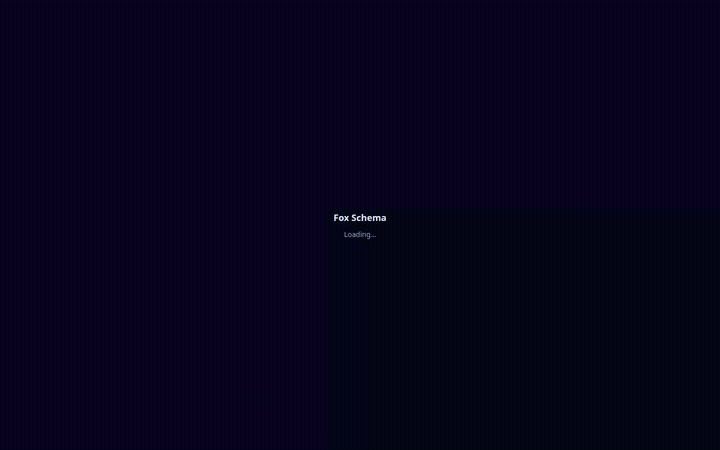
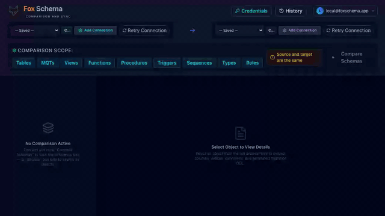

<div align="center">

# Fox Schema

**Compare schemas · generate migrations · run SQL — across 10 dialects.**

Install once, then open the local web UI (`foxschema`) for **Schema Sync** and the
**SQL Editor**. Self-host with Docker when you need a server.

[foxschema.com](https://foxschema.com) · [Install](docs/INSTALL.md) · [User guide](docs/USER_GUIDE.md) · [Publish](docs/PUBLISH.md) · [Contributing](CONTRIBUTING.md)

<p>
  <a href="https://www.npmjs.com/package/foxschema"></a>
  <a href="https://hub.docker.com/r/5nickels/foxschema"></a>
  
  
  
</p>

</div>

## Install

Requires **Node.js ≥ 22.5** (npm / Homebrew). Docker needs no Node.

```bash
# npm — macOS, Windows, Linux (arm64 + x64)
npm install -g foxschema

# Homebrew — macOS (formula in this repo; Homebrew 6+ needs trust once)
brew tap tedious-code/foxschema https://github.com/tedious-code/foxschema
brew trust tedious-code/foxschema
brew install foxschema

# Docker — servers (linux/amd64, includes Db2)
docker pull 5nickels/foxschema:latest
```

Windows:

```powershell
winget install OpenJS.NodeJS.LTS
npm install -g foxschema
```

Full matrix: **[docs/INSTALL.md](docs/INSTALL.md)**.

## Use the app

```bash
foxschema                 # start UI on http://localhost:3210 and open the browser
foxschema shortcut        # put a Fox icon on your Desktop
foxschema stop            # stop the background server
foxschema doctor
```

Headless / CI:

```bash
foxschema compare --source a --target b
foxschema migrate --source a --target b
foxschema tui
```

## SQL Editor (0.2)

A full query workbench next to Schema Sync — not a thin prompt.



| Feature | What you get |
|---------|----------------|
| **Multi-destination Run** | Same SQL against every checked connection; By-cred or Side-by-side results |
| **Notebook cells** | SQL + `-- @js` / `-- @ts` / `-- @node` cells with per-cell ▶ and `Out [n]` |
| **FoxScript** | Monaco language, fences, markers, schema-aware tokens |
| **Data Peek** | Cmd/Ctrl-click a table in Schema, or click rust FK cells in results; edit rows when allowed |
| **Peek tools** | WHERE / ORDER BY / LIMIT, Prev/Next, drag ⋮⋮ to arrange, resize |
| **Query files** | CSV / JSON / fixed-width → temp `Files:` SQLite or bulk-load into a saved credential |
| **Schema explorer** | Insert names, autocomplete, edit table / view source |
| **Variables & secrets** | `${{name}}`, `@set`, session secrets, code-cell `vars` |
| **Safe mode** | Confirm writes; bookmarks & samples included |
| **Access control** | Optional `admin` / `editor` / `viewer` roles when multi-user login is on |

Walkthrough: [User guide → SQL Editor](docs/USER_GUIDE.md#sql-editor).

## Schema Sync

Point Fox at a **source** and a **target**. It introspects both, shows a color-coded
diff, then generates DDL to align the target (dry-run by default).


- **Schema diff** — tables, columns, keys, indexes, constraints, views, routines…
- **Migration generation** — reviewable target-dialect DDL
- **Cross-dialect aware** — fewer false positives (e.g. Postgres → MySQL)
- **Safe apply** — dry-run default; skip-on-error optional; history recorded
- **Credentials encrypted at rest** — passwords never returned to the browser

Cross-dialect demo:



## Docker (self-host)

```bash
docker run -d --name foxschema \
  -p 3001:3001 \
  -v foxschema_data:/data \
  5nickels/foxschema:latest
```

Open **http://localhost:3001**. Guide: [docs/DEPLOYMENT.md](docs/DEPLOYMENT.md).

## Supported dialects

PostgreSQL · MySQL · MariaDB · SQL Server · Azure SQL · Oracle · IBM Db2 ·
SQLite · ClickHouse · Amazon Redshift

One product — Docker image includes Db2 on linux/amd64.

## Package notes (npm)

The published `foxschema` CLI is built from **TypeScript** and ships as **Node ESM**
(`"type": "module"`) with a `types` entry for tooling. Native drivers may load as
CommonJS at runtime. Requires **Node ≥ 22.5**.

## How it's built

| Workspace | Role |
|-----------|------|
| `packages/core` | Diff / migration engine and dialect providers |
| `apps/web` | Express API + React UI (CLI launcher + Docker) |
| `apps/cli` | `foxschema` CLI, desktop shortcut, TUI |
| `apps/e2e` | Playwright tests against dockerized databases |

Maintainers: [docs/PUBLISH.md](docs/PUBLISH.md) · [docs/ARCHITECTURE.md](docs/ARCHITECTURE.md).

## License

Copyright 2024–2026 Huy Phan `<huyplb@gmail.com>` and [tedious-code](https://github.com/tedious-code)
contributors. See [NOTICE](NOTICE) and [LICENSE](LICENSE) (Apache-2.0).

Keep copyright / NOTICE / LICENSE when you fork or redistribute — stripping
authorship notices is not allowed under the License.
