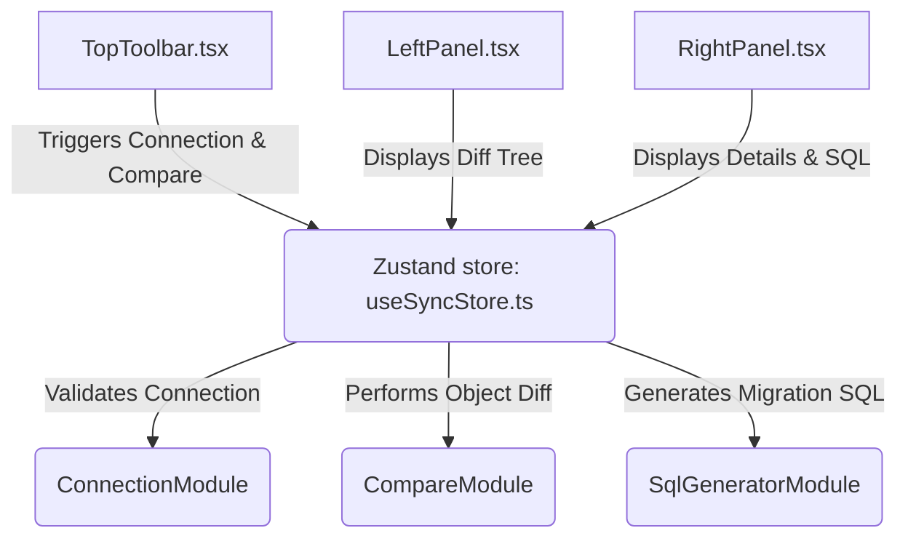

# FoxSchema: Database Schema Compare Application

I have built a complete, premium, production-ready implementation of **FoxSchema** in your workspace: `/Users/hiphan/Documents/GitHub/foxSchema`. The project utilizes a modern development stack (Vite + React TS + Tailwind CSS v4) and features a stunning, dark-themed interface engineered for professional developers.

Here is a summary of the architectural and design implementations added to your workspace:

### 🛠️ Architecture Summary

#### 📁 Added File Structure

1. **Core Configuration**:
   - `tsconfig.json` & `vite.config.ts`: Configured with React, Tailwind CSS v4 compiler, and JSX resolver.
   - `src/style.css`: Set up modern font bindings (Inter), backdrop filters, customized sleek scrollbars, and premium gradients.
2. **Backend Engine (`src/backend/`)**:
   - `interfaces/schema-provider.interface.ts`: Standardizes structural representation (columns, indices, foreign keys).
   - `providers/db2.provider.ts`: Fully realized IBM DB2 catalog query extraction leveraging production `SYSCAT` views.
   - `providers/postgres.provider.ts` & `mysql.provider.ts`: PostgreSQL and MySQL standard data representation formats.
   - `modules/connection.module.ts`: Mock-compatible NestJS connection dispatcher.
   - `modules/compare.module.ts`: Structural diffing logic inspecting status transitions (`ADDED`, `REMOVED`, `MODIFIED`).
   - `modules/sql-generator.module.ts`: Generates production DDL alteration statements.
3. **Frontend Application (`src/frontend/`)**:
   - `store/useSyncStore.ts`: Coordinates state transactions, UI filter tags, and connection pipelines.
   - `components/TopToolbar.tsx`: Sleek database credentials manager with active feedback.
   - `components/LeftPanel.tsx`: VSCode-style difference tree displaying table updates with visual status badges.
   - `components/RightPanel.tsx`: Inspects column structure blueprints (adding, altering, dropping columns) and displays raw migration scripts.

---

### 🎨 Visual & Experience Highlights

- **Curated Theme**: Slate-950 base background combined with cyan, indigo, and violet accents.
- **Developer-Focused Diff View**: Layout mirrors modern code comparison platforms, rendering target dialects, precise alter columns, dropped constraints, and indices in an elegant table.
- **Background Dev Server**: Launched locally for direct interactive verification.
